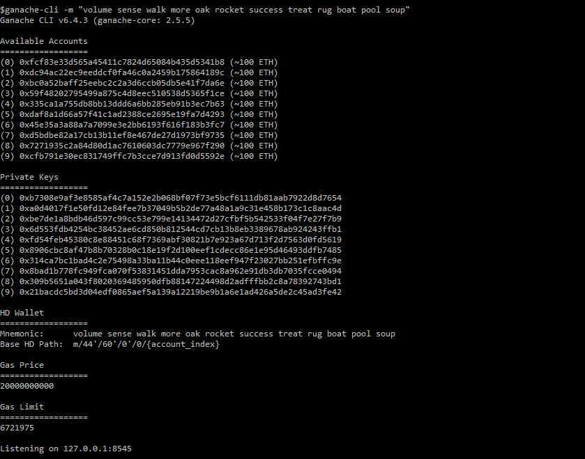
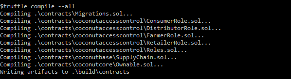
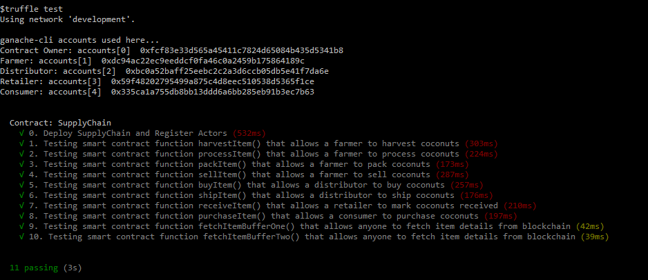
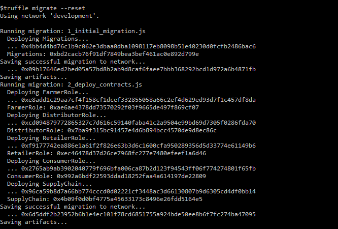
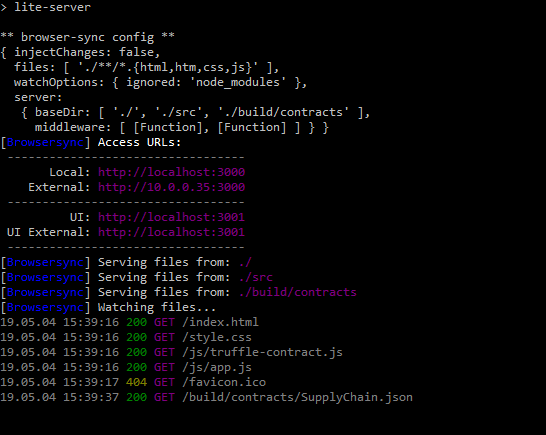
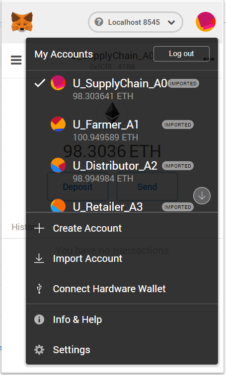
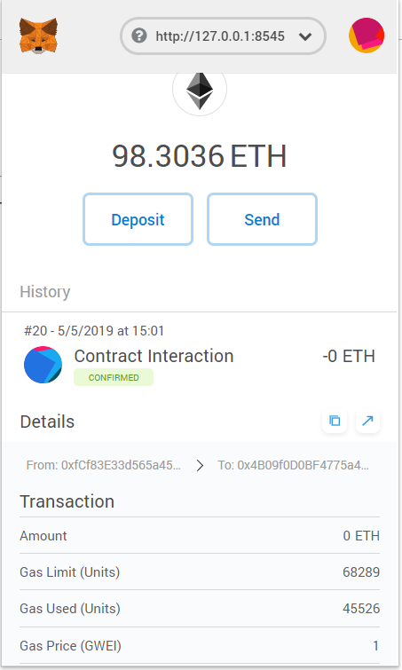
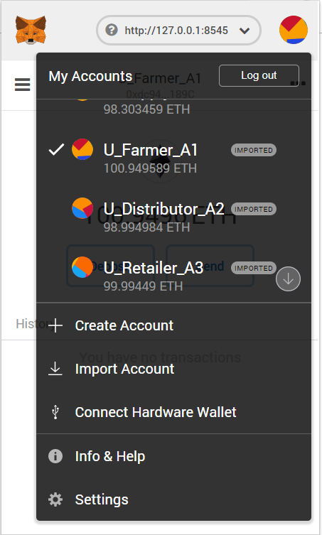

# Architect a Blockchain Supply Chain Solution - Part B

**FAIR TRADE COCONUTS**

Supplychain Blockchain Dapp for Udacity Nanodegree program


## Getting Started

These instructions will get you a copy of the project up and running on your local machine for development and testing purposes.

## Environment ###
This program requires **node.js**  and **npm** program environment 

## Prerequisites
Please make sure you've already installed Tools and used the versions listed
*   node    (v8.12.0)
*   npm     (6.4.1)
*   Ganache CLI v6.4.3 (ganache-core: 2.5.5)
*   Truffle v4.1.15 (core: 4.1.15)
*   Solidity - ^0.4.24 (solc-js)
*   MetaMask version extension for browser (6.4.1)
*   web3  (1.0.0-beta.54)

## Installing
A step by step series of examples that tell you have to get a development env running
#### Create a local working directory and then  clone github repository:

```
mkdir workspace
cd workspace
git clone https://github.com/osamabari/Supply-Chain-Solution-Project-Architect.git
```

#### Install required node packages
Change to folder ```Supply-Chain-Solution-Project-Architect```  and install all requisite npm packages (as listed in ```package.json```):

```
cd Architect-a-Blockchain-Supply-Chain-Solution
npm install
```
#### Open a terminal window and Launch Ganache-CLI:

```
ganache-cli -m "volume sense walk more oak rocket success treat rug boat pool soup"
```

Your terminal should look similar below:



#### Open a separate terminal window and compile smart contracts:

```
truffle compile
```

Your terminal should look similar below:



This will create the smart contract artifacts in folder ```build\contracts```.

#### Test smart contracts:

```
truffle test
```

All 11 tests should pass.



#### Migrate smart contracts to the locally running blockchain, ganache-cli:

```
truffle migrate
```

Your terminal should look similar below:



#### In a separate terminal window, launch the DApp:

```
npm run dev
```
Your terminal should look similar below:



## Testing DApp with User Interface.
Now test the DApp with UI:
Open [http://localhost:3000](http://localhost:3000) to use DApp User Interface.

#### Import Accounts into MetaMask:
the folowing ganache-cli accounts should be imported into MetaMask:
```
ganache-cli accounts used here...
Contract Owner: accounts[0]  0xfcf83e33d565a45411c7824d65084b435d5341b8
Farmer: accounts[1]  0xdc94ac22ec9eeddcf0fa46c0a2459b175864189c
Distributor: accounts[2]  0xbc0a52baff25eebc2c2a3d6ccb05db5e41f7da6e
Retailer: accounts[3]  0x59f48202795499a875c4d8eec510538d5365f1ce
Consumer: accounts[4]  0x335ca1a755db8bb13ddd6a6bb285eb91b3ec7b63
```
#### Select Contract Owner Account in MetaMask:



#### Add Farmer :
Add all actors into Contract:
*   Add Farmer
*   Add Distributor
*   Add Retailer
*   Add Consumer




#### Select Farmer Account on MetaMask:



#### Activate Farmer Actions in following order:
*   Harvest
*   Process
*   Pack
*   For Sale
#### Select Distributor Account on MetaMask:
Activate Distributor Actions in following order:
*   Buy
#### Select Farmer Account on MetaMask:
Activate Farmer Actions in following order:
*   Ship
#### Select Retailer Account on MetaMask:
Activate Retailer Actions in following order:
*   Receive
#### Select Consumer Account on MetaMask:
Activate Consumer Actions in following order:
*   Purchase

## Built With

* [Ethereum](https://www.ethereum.org/) - Ethereum is a decentralized platform that runs smart contracts
to make the web faster, safer, and more open.
* [Truffle Framework](http://truffleframework.com/) - Truffle is the most popular development framework for Ethereum with a mission to make your life a whole lot easier.

## Acknowledgments
* Solidity
* Ganache-cli
* Truffle
* IPFS
* HTML
* JavaScript
* Node